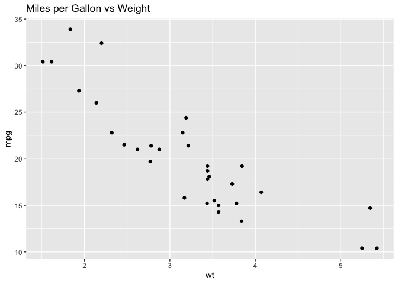

# Quarto Example


Below is an R code block

``` r
library(ggplot2)

mtcars |>
    ggplot(aes(x = wt, y = mpg)) +
    geom_point() +
    labs(title = "Miles per Gallon vs Weight")
```



The heavier a vehicle, the worse its gas mileage!
